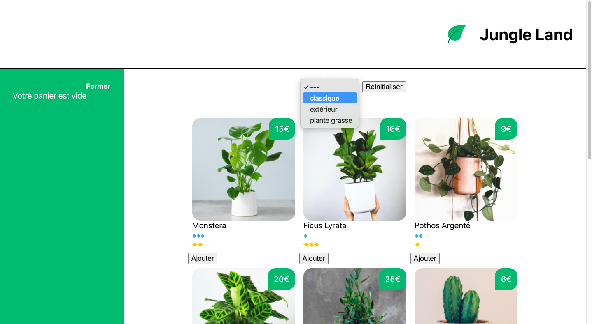
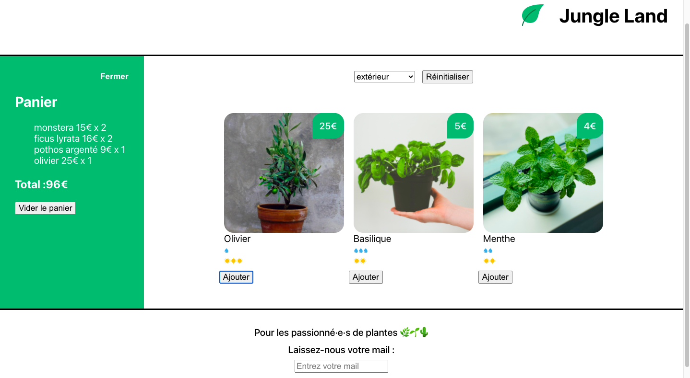
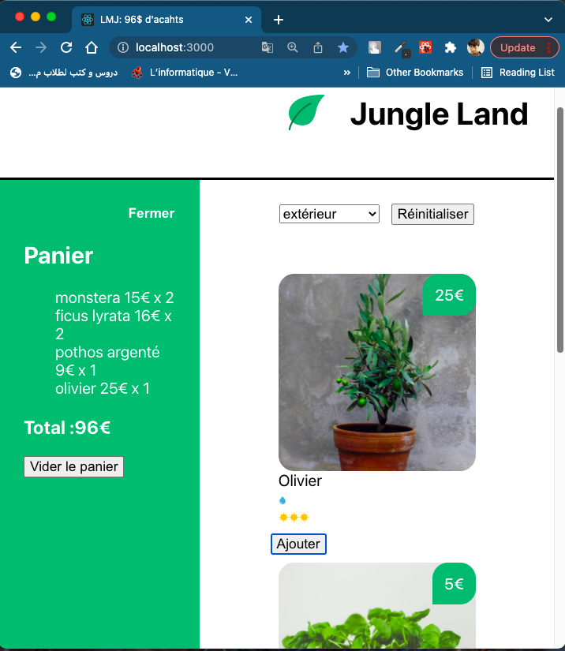

# Plants e-commerce frontend project
The websites presents different categories of plants, displays price, watering amount and sun exposition for each plant.
The user can add plants to their cart, the price and number of plants added is displayed as well.

## Screenshots

 
 
  

## Technology used

- ReactJS
- CSS
- VSCode
- React CLI

## Run this project?

- Clone this repo
- cd into the directory
- run 'npm start'

## Upcoming features
Transforming this front-end project into a fullstack one:
- Using a databse system to store data
- Adding user authentication

